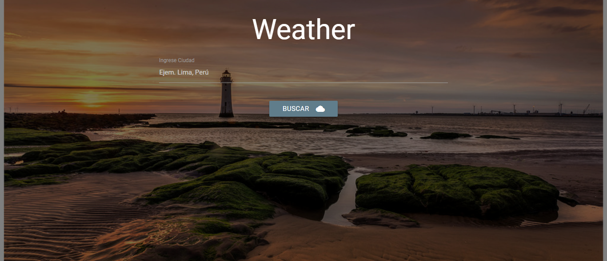
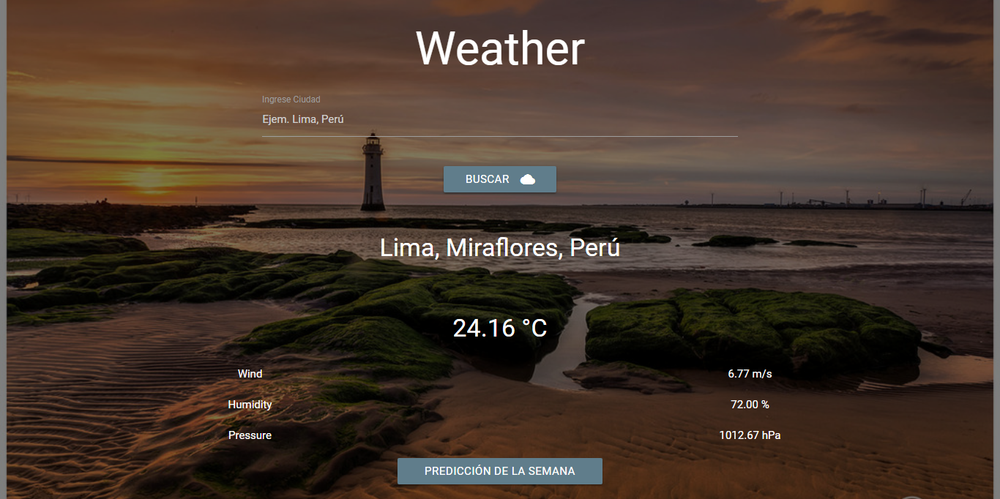
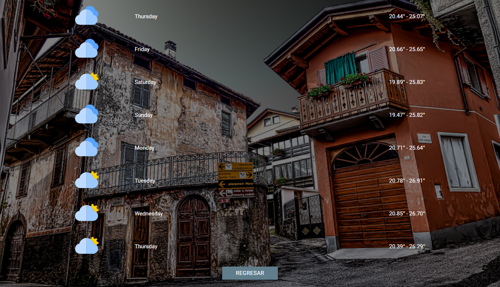

# **API DARK SKY WEATHER**

</img>

<a  href="https://travis-ci.org/t4t5/sweetalert"><a>

##  **OBJETIVO**

Crear una aplicacion que nos permita predecir el clima.

## **Desarrollo**

Para el desarrollo de nuestra aplicacion se utilizo el api de Dark Sky.

Nuestra aplicacion te permite introducir la ciudad y saber el clima, incluye autocompletado para una facil interaccion.

.

El resutado de la consulta a la ubicacion Lima, Miraflores, Peru.

.

Tambien tiene la opcion de que puedas visualizar el pronostico del tiempo de la semana entrante.

.

##  Tecnologias Usadas
- jquery
- javascript
- Html5
- Api de Dark Sky Weather
- Ajax

## Autores

- **Claudia Garibotto** - [@claudiagari](https://github.com/claudiagari)

- **Wendy Quispe** - [@wendytamara](https://github.com/wendytamara)

## Licencia

Este proyecto está licenciado bajo la Licencia ISC - ver el archivo [LICENSE](https://www.isc.org) para más detalles.

Copyright &copy; 2018 All Rights Reserved.
